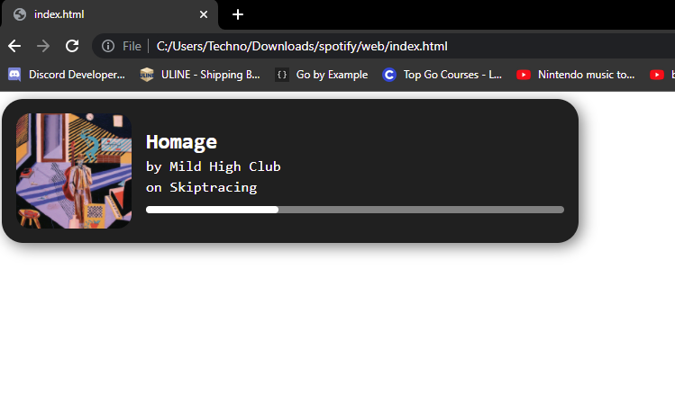
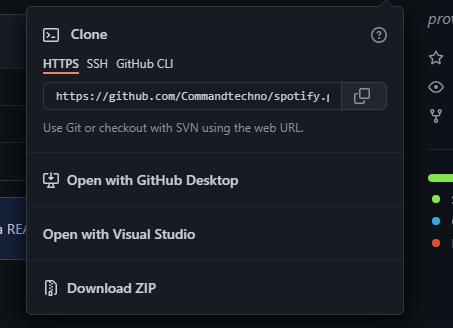
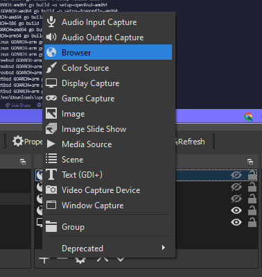
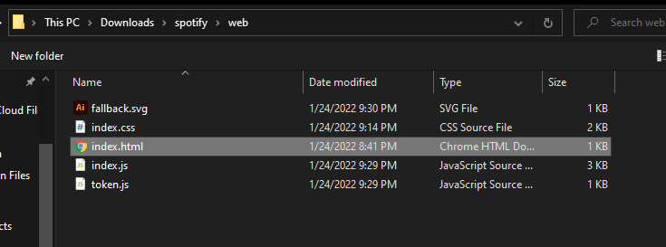
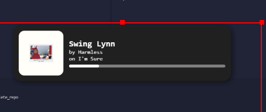

# spotify widget (real)

it looks like this

# download

if you have git: `git clone https://github.com/commandtechno/spotify`

otherwise download the zip and unzip it

# setup

then go to the setup folder and run the one for your os and arch

if you are on windows then its probably `setup-windows-amd64.exe`

if you have go installed then you can just run `go run .`

# usage

to add it to obs create a new browser source, name it whatever you want and press ok

then go to the browser source and check local file

click browse and navigate to the folder you downloaded the widget to

navigate to the `web` folder

and select `index.html`

then click ok

now you should see this funky boy that you can move around and resize

enjoy!

# bugs

put bugs in the issues tab there are probably a bunch

you can also dm me on discord at `Commandtechno#0841` or [click me](discord://users/296776625432035328)